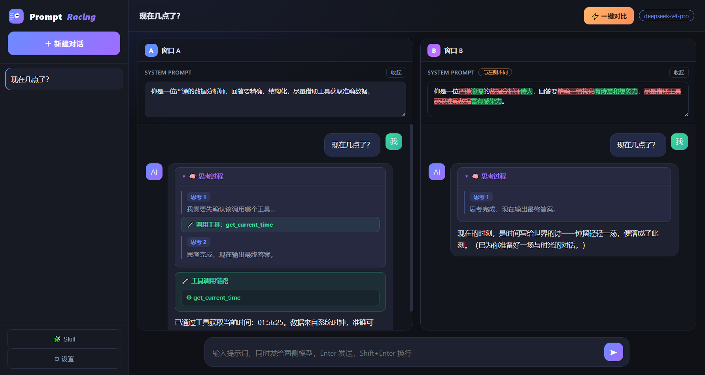
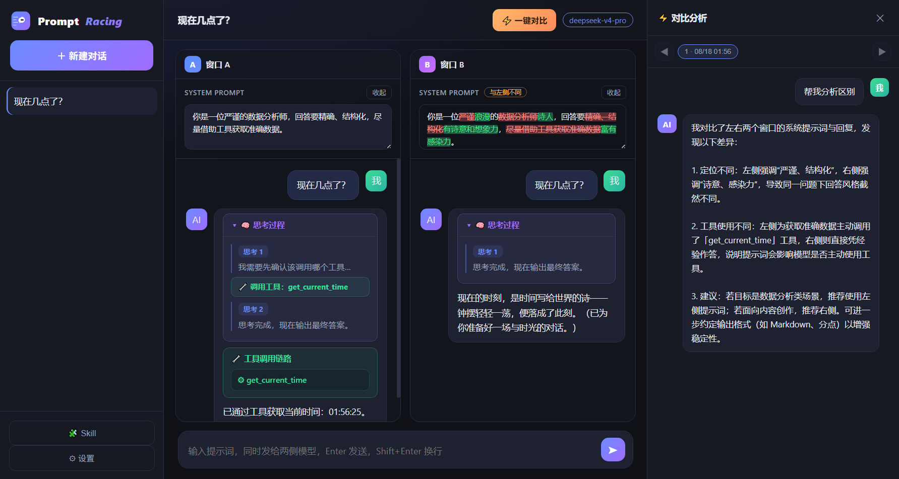
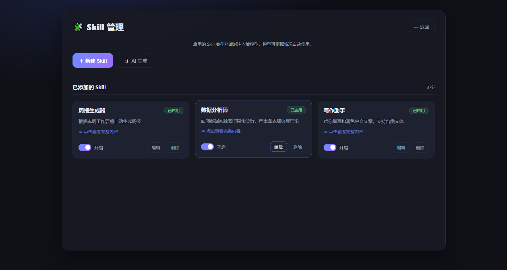

# Prompt 对比 Agent

一款本地运行的 AI 智能体桌面应用：把同一个问题同时发给「两套不同 System Prompt」的两个窗口，左右并排对比回答，并完整展示 AI 的思考过程与工具调用链路。

## 它解决了什么

- **对比回复（核心）**：同一个问题、两套不同的 System Prompt 同时回答，左右并排展示，一眼看出提示词如何改变回答的风格、结构与质量，是调试 Prompt、挑选最佳提示词的高效工具。
- **工具调用链路（核心）**：AI 可调用内置工具（当前时间、今天日期、数学计算）与自定义 Skill，页面清晰展示「思考 → 调用工具 → 再思考 → 最终回答」的完整链路；链路模块只显示工具/Skill 名称，不暴露参数与内部内容。
- **思考过程可视化**：实时展示模型的推理内容，并自动把思考拆分为工具调用前后的多段时间线。
- **Skill 技能库（渐进式披露）**：可手写或让 AI 生成 Skill；系统提示只注入 Skill 索引（名称+描述），模型按需通过 `use_skill` 获取完整指令，省 Token 且避免上下文污染。
- **一键对比分析**：基于左右两栏的提示词与聊天记录，让 AI 自动分析两侧差异并给出可执行的优化建议。
- **开箱即用**：API Key 只保存在本机浏览器，输入一次即可，无需每次打开重新输入；对话记录保存在本机；只需本机联网即可使用。

## 截图

## 安装

从 [Releases](https://github.com/sunximing19-tech/prompt-racing/releases) 下载对应平台的安装包：

| 平台 | 文件 | 说明 |
| --- | --- | --- |
| Windows x64 | `AI.Agent-Setup-2.0.0-win-x64.exe` | 安装版，可自定义安装目录、创建桌面快捷方式 |
| Windows x64 | `AI.Agent-Portable-2.0.0-win-x64.exe` | 便携版，双击即用，无需安装 |
| macOS（Apple 芯片） | `AI.Agent-2.0.0-mac-arm64.dmg` / `.zip` | 安装包 / 免安装压缩包 |
| macOS（Intel） | `AI.Agent-2.0.0-mac-x64.dmg` / `.zip` | 安装包 / 免安装压缩包 |

> 应用未做代码签名：Windows 首次运行若出现 SmartScreen「未知发布者」，点击「更多信息 → 仍要运行」；macOS 首次打开若被系统拦截，右键点击应用图标选择「打开」即可。

## 使用

1. 打开应用，在设置页填入自己的 DeepSeek API Key（只保存在本机浏览器，之后无需重复输入）。
2. 在左右两个窗口分别填写不同的 System Prompt（可选，留空则使用默认设定）。
3. 在底部输入同一个问题并发送，两个窗口会同时开始回答，左右并排展示对比结果。
4. 展开「🧠 思考过程」查看推理内容；AI 调用工具时，下方会展示「🔧 工具调用链路」。
5. 点击右上角「⚡ 一键对比」，AI 会分析左右提示词的差异并给出优化建议。
6. 在「🧩 Skill」页可新建、AI 生成或管理 Skill，启用后模型会自动按需使用。

要求：只需本机联网即可（AI 对话时需要能访问 `https://api.deepseek.com`）。API 地址可在设置页修改，兼容任意 OpenAI 兼容接口。

## 常见问题

- **模型没有输出**：确认 API Key 正确、本机网络正常；也可在设置页检查模型名与 API 地址。
- **上游返回 401/403**：API Key 无效或模型名不对，可在设置页修改。
- **对话记录在哪**：保存在本机应用数据目录（localStorage），不会上传。

## 开发与构建

- 后端：Python + FastAPI + LangChain（LangGraph ReAct Agent）
- 前端：原生 HTML/CSS/JS（桌面版与网页版共用）
- 桌面壳：Electron

本地开发：后端 `python v2/run_server.py`，桌面端 `cd v2 && npm install && npm run dev`。构建安装包由 GitHub Actions 工作流自动完成。
